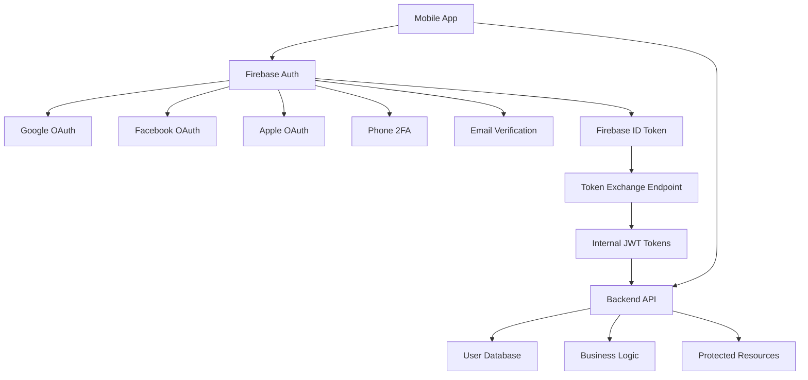

# 🔐 Firebase Auth Integration Plan for Pika

## 📋 Executive Summary

**Objective:** Integrate Firebase Authentication to enable external provider login (Google, Facebook) and 2FA while maintaining our robust JWT-based API authentication system.

**Approach:** Hybrid Authentication System combining Firebase Auth strengths with our existing secure JWT infrastructure.

---

## 🏗️ Current State Analysis

### ✅ Strengths

- **Solid JWT Infrastructure**: 15min access + 7day refresh tokens with Redis blacklisting
- **Clean Architecture**: Domain-driven design with proper separation of concerns
- **Comprehensive User Schema**: Multi-table design with identity provider support
- **Strong Security**: Bcrypt hashing, rate limiting, RBAC, audit logging
- **Firebase Foundation**: Existing custom token generation and emulator setup

### ❌ Gaps

- No external provider authentication (Google, Facebook, Apple)
- No 2FA/MFA implementation
- No device management or trusted device tracking
- Limited Firebase Auth integration (custom tokens only)

---

## 🎯 Industry Standard Architecture

### Hybrid Authentication System



**Firebase Auth Handles:**

- 🔑 External provider authentication (OAuth 2.0 flows)
- 📱 2FA/MFA (SMS, TOTP, Email verification)
- 🛡️ Device management and security
- ⚡ Real-time authentication state
- 🔄 Token refresh and session management

**Internal JWT System Handles:**

- 🏢 API authentication and authorization
- 👥 RBAC enforcement and business permissions
- 🔗 Service-to-service communication
- 💾 Data access and business logic
- 📊 Audit logging and compliance

---

## 🗄️ Database Schema Updates

### 1. Enhanced Identity Provider Table

```sql
-- Update existing user_identities table
ALTER TABLE auth.user_identities
ADD COLUMN firebase_uid VARCHAR(128) UNIQUE,
ADD COLUMN provider_data JSONB,
ADD COLUMN last_sign_in_method VARCHAR(50),
ADD COLUMN is_email_verified BOOLEAN DEFAULT FALSE,
ADD COLUMN is_phone_verified BOOLEAN DEFAULT FALSE,
ADD COLUMN created_at TIMESTAMP WITH TIME ZONE DEFAULT NOW(),
ADD COLUMN updated_at TIMESTAMP WITH TIME ZONE DEFAULT NOW();

-- Add index for Firebase UID lookups
CREATE INDEX CONCURRENTLY idx_user_identities_firebase_uid
ON auth.user_identities(firebase_uid) WHERE firebase_uid IS NOT NULL;

-- Add composite index for provider queries
CREATE INDEX CONCURRENTLY idx_user_identities_provider_lookup
ON auth.user_identities(provider, provider_id, user_id);
```

### 2. New Authentication Methods Table

```sql
-- Track multiple authentication methods per user
CREATE TABLE auth.user_auth_methods (
    id UUID PRIMARY KEY DEFAULT gen_random_uuid(),
    user_id UUID NOT NULL REFERENCES users.users(id) ON DELETE CASCADE,
    auth_method VARCHAR(50) NOT NULL, -- 'password', 'google', 'facebook', 'phone', 'totp'
    provider_data JSONB,
    is_verified BOOLEAN DEFAULT FALSE,
    is_enabled BOOLEAN DEFAULT TRUE,
    last_used_at TIMESTAMP WITH TIME ZONE,
    created_at TIMESTAMP WITH TIME ZONE DEFAULT NOW(),
    updated_at TIMESTAMP WITH TIME ZONE DEFAULT NOW(),

    UNIQUE(user_id, auth_method)
);

CREATE INDEX idx_user_auth_methods_user_id ON auth.user_auth_methods(user_id);
CREATE INDEX idx_user_auth_methods_method ON auth.user_auth_methods(auth_method);
```

### 3. Device Management Table

```sql
-- Track trusted devices for enhanced security
CREATE TABLE auth.user_devices (
    id UUID PRIMARY KEY DEFAULT gen_random_uuid(),
    user_id UUID NOT NULL REFERENCES users.users(id) ON DELETE CASCADE,
    device_id VARCHAR(255) NOT NULL, -- Firebase Installation ID
    device_name VARCHAR(255),
    device_type VARCHAR(50), -- 'ios', 'android', 'web'
    browser_info JSONB,
    last_ip_address INET,
    last_location GEOGRAPHY(POINT, 4326),
    is_trusted BOOLEAN DEFAULT FALSE,
    fcm_token VARCHAR(500),
    last_active_at TIMESTAMP WITH TIME ZONE,
    created_at TIMESTAMP WITH TIME ZONE DEFAULT NOW(),

    UNIQUE(user_id, device_id)
);

CREATE INDEX idx_user_devices_user_id ON auth.user_devices(user_id);
CREATE INDEX idx_user_devices_active ON auth.user_devices(user_id, last_active_at DESC);
```

### 4. 2FA Settings Table

```sql
-- User 2FA preferences and backup codes
CREATE TABLE auth.user_mfa_settings (
    id UUID PRIMARY KEY DEFAULT gen_random_uuid(),
    user_id UUID NOT NULL REFERENCES users.users(id) ON DELETE CASCADE,
    is_enabled BOOLEAN DEFAULT FALSE,
    preferred_method VARCHAR(50), -- 'sms', 'totp', 'email'
    backup_codes_generated_at TIMESTAMP WITH TIME ZONE,
    backup_codes_used INTEGER DEFAULT 0,
    recovery_email VARCHAR(255),
    created_at TIMESTAMP WITH TIME ZONE DEFAULT NOW(),
    updated_at TIMESTAMP WITH TIME ZONE DEFAULT NOW(),

    UNIQUE(user_id)
);
```

---

## 🔄 Authentication Flow Design

### 1. External Provider Registration Flow

```typescript
// New registration with external provider
interface ExternalProviderRegistrationRequest {
  firebaseIdToken: string
  providerType: 'google' | 'facebook' | 'apple'
  deviceInfo: {
    deviceId: string
    deviceName: string
    deviceType: 'ios' | 'android' | 'web'
    fcmToken?: string
  }
  additionalInfo?: {
    phoneNumber?: string
    preferredLanguage?: string
  }
}

interface AuthenticationResponse {
  success: boolean
  data: {
    user: UserEntity
    tokens: {
      accessToken: string // Our JWT for API access
      refreshToken: string // Our refresh token
      firebaseToken: string // Firebase custom token for real-time
      expiresAt: string
      refreshExpiresAt: string
    }
    isNewUser: boolean
    requiresAdditionalInfo: boolean // For profile completion
    mfaRequired: boolean
  }
}
```

### 2. Token Exchange Endpoint

```typescript
// Exchange Firebase ID token for internal JWT
POST /auth/firebase-exchange
{
  "firebaseIdToken": "eyJhbGciOiJSUzI1NiIs...",
  "deviceInfo": {
    "deviceId": "firebase-installation-id",
    "deviceName": "John's iPhone",
    "deviceType": "ios",
    "fcmToken": "fcm-token-for-push"
  }
}

// Response includes both token types
{
  "accessToken": "internal-jwt-token",
  "refreshToken": "internal-refresh-token",
  "firebaseCustomToken": "firebase-custom-token",
  "user": { /* user data */ },
  "requiresMfa": false
}
```

### 3. 2FA Flow Integration

```typescript
// Enable 2FA
POST /auth/mfa/enable
{
  "method": "sms" | "totp" | "email",
  "phoneNumber"?: "+1234567890", // For SMS
  "email"?: "user@example.com"   // For email
}

// Verify 2FA during login
POST /auth/mfa/verify
{
  "mfaToken": "temporary-mfa-token",
  "verificationCode": "123456",
  "trustDevice": true // Optional
}
```

---

## 📱 Flutter Implementation Strategy

### 1. Enhanced Auth Data Source

```dart
// New Firebase Auth methods
abstract class FirebaseAuthDataSource {
  Future<UserCredential> signInWithGoogle();
  Future<UserCredential> signInWithFacebook();
  Future<UserCredential> signInWithApple();
  Future<void> verifyPhoneNumber(String phoneNumber);
  Future<UserCredential> signInWithPhoneNumber(String verificationId, String smsCode);
  Future<void> enableMFA();
  Future<void> disableMFA();
  Stream<User?> authStateChanges();
}

// Enhanced remote data source
abstract class AuthRemoteDataSource {
  // Existing methods...

  // New Firebase integration methods
  Future<AuthResponse> exchangeFirebaseToken(String idToken, DeviceInfo deviceInfo);
  Future<AuthResponse> linkExternalProvider(String accessToken, String idToken);
  Future<void> enableMFA(MFAMethod method, {String? phoneNumber});
  Future<MFAVerificationResult> verifyMFA(String code, String mfaToken);
  Future<List<AuthMethod>> getUserAuthMethods();
  Future<List<TrustedDevice>> getTrustedDevices();
}
```

### 2. Updated Use Cases

```dart
// New use cases for external auth
class SignInWithGoogleUseCase {
  final AuthRepository repository;
  final FirebaseAuthDataSource firebaseAuth;

  Future<Either<AuthFailure, AuthResult>> call() async {
    try {
      // 1. Sign in with Firebase
      final userCredential = await firebaseAuth.signInWithGoogle();
      final idToken = await userCredential.user?.getIdToken();

      // 2. Exchange for internal tokens
      final authResult = await repository.exchangeFirebaseToken(idToken!, deviceInfo);

      // 3. Handle MFA if required
      if (authResult.requiresMfa) {
        return Left(AuthFailure.mfaRequired(authResult.mfaToken));
      }

      return Right(authResult);
    } catch (e) {
      return Left(AuthFailure.external(e.toString()));
    }
  }
}

class EnableMFAUseCase {
  final AuthRepository repository;

  Future<Either<AuthFailure, void>> call(MFAMethod method) async {
    return repository.enableMFA(method);
  }
}
```

### 3. Enhanced Auth State Management

```dart
// Updated auth states
abstract class AuthState {
  const AuthState();
}

class AuthInitial extends AuthState {}
class AuthLoading extends AuthState {}
class AuthAuthenticated extends AuthState {
  final UserEntity user;
  final List<AuthMethod> authMethods;
  final bool isMfaEnabled;
  final List<TrustedDevice> trustedDevices;
}
class AuthUnauthenticated extends AuthState {}
class AuthMfaRequired extends AuthState {
  final String mfaToken;
  final List<MFAMethod> availableMethods;
}
class AuthError extends AuthState {
  final String message;
  final AuthErrorType type;
}

enum AuthErrorType {
  network,
  invalidCredentials,
  mfaRequired,
  accountLocked,
  externalProvider,
  deviceNotTrusted,
}
```

---

## 🛠️ Implementation Phases

### Phase 1: Foundation (Week 1-2)

**Goal:** Set up Firebase Auth infrastructure and basic external provider auth

**Backend Tasks:**

- [ ] Update database schema (identity tables, auth methods)
- [ ] Create Firebase ID token verification service
- [ ] Implement token exchange endpoint
- [ ] Add Google OAuth provider support
- [ ] Update auth middleware to handle Firebase tokens

**Frontend Tasks:**

- [ ] Set up Firebase Auth SDK properly for all platforms
- [ ] Implement Google Sign-In button and flow
- [ ] Create Firebase auth data source
- [ ] Update auth repository to handle external providers
- [ ] Add external provider sign-in screens

**Testing:**

- [ ] Test Google Sign-In flow end-to-end
- [ ] Verify token exchange and JWT generation
- [ ] Test account linking for existing users

### Phase 2: Facebook Integration (Week 3)

**Goal:** Add Facebook authentication and improve provider abstraction

**Backend Tasks:**

- [ ] Add Facebook OAuth provider support
- [ ] Enhance provider abstraction for future additions
- [ ] Implement account linking logic
- [ ] Add provider-specific error handling

**Frontend Tasks:**

- [ ] Implement Facebook Sign-In button and flow
- [ ] Add provider selection screen
- [ ] Handle account linking scenarios
- [ ] Add provider management in user settings

**Testing:**

- [ ] Test Facebook Sign-In flow
- [ ] Test account linking between providers
- [ ] Test provider switching scenarios

### Phase 3: 2FA Implementation (Week 4-5)

**Goal:** Add comprehensive 2FA support with multiple methods

**Backend Tasks:**

- [ ] Create MFA settings and device management tables
- [ ] Implement SMS 2FA using Firebase Phone Auth
- [ ] Add TOTP support for authenticator apps
- [ ] Create backup code generation and management
- [ ] Implement trusted device tracking

**Frontend Tasks:**

- [ ] Create 2FA setup and management screens
- [ ] Implement SMS verification flow
- [ ] Add TOTP QR code generation and verification
- [ ] Create device management interface
- [ ] Add backup code display and verification

**Testing:**

- [ ] Test SMS 2FA flow
- [ ] Test TOTP app integration
- [ ] Test backup code scenarios
- [ ] Test trusted device behavior

### Phase 4: Enhanced Security (Week 6)

**Goal:** Add advanced security features and monitoring

**Backend Tasks:**

- [ ] Implement device fingerprinting
- [ ] Add location-based security checks
- [ ] Create suspicious activity detection
- [ ] Add comprehensive audit logging
- [ ] Implement account recovery flows

**Frontend Tasks:**

- [ ] Add security settings dashboard
- [ ] Implement account recovery flows
- [ ] Create security alerts and notifications
- [ ] Add activity monitoring interface

**Testing:**

- [ ] Test security scenarios (location changes, new devices)
- [ ] Test account recovery flows
- [ ] Test suspicious activity detection

### Phase 5: Future Provider Support (Week 7)

**Goal:** Make system extensible for Apple, Microsoft, and other providers

**Backend Tasks:**

- [ ] Create generic OAuth provider framework
- [ ] Add Apple Sign-In support
- [ ] Add Microsoft/LinkedIn support (optional)
- [ ] Create provider configuration system

**Frontend Tasks:**

- [ ] Add Apple Sign-In (iOS/Web)
- [ ] Create generic provider button components
- [ ] Add provider configuration UI (admin)

---

## 🔒 Security Considerations

### 1. Token Security

- **Firebase ID Token Validation:** Verify tokens server-side using Firebase Admin SDK
- **Token Exchange Rate Limiting:** Prevent token exchange abuse
- **JWT Security:** Maintain current JWT security practices
- **Token Binding:** Bind Firebase and internal tokens to device/session

### 2. Provider Security

- **OAuth PKCE:** Use PKCE for mobile OAuth flows
- **State Parameter:** Prevent CSRF attacks in OAuth flows
- **Scope Minimization:** Request only necessary permissions from providers
- **Token Revocation:** Handle provider token revocation gracefully

### 3. 2FA Security

- **TOTP Time Window:** Standard 30-second time window with ±1 window tolerance
- **Backup Codes:** Generate 10 single-use backup codes, securely hashed
- **SMS Security:** Rate limit SMS sends, validate phone number formats
- **Recovery Flow:** Secure account recovery without compromising security

### 4. Device Security

- **Device Fingerprinting:** Combine device ID, browser info, and network data
- **Trusted Device TTL:** Expire trusted device status after 30 days
- **Location Validation:** Flag logins from unusual geographic locations
- **Concurrent Session Limits:** Limit active sessions per user

---

## 📊 Monitoring & Analytics

### 1. Authentication Metrics

- External provider adoption rates
- 2FA enrollment and usage rates
- Failed authentication attempts by provider
- Token exchange success/failure rates
- Account linking success rates

### 2. Security Metrics

- Suspicious login attempts
- Geographic login patterns
- Device trust establishment rates
- MFA bypass attempts
- Account recovery requests

### 3. Performance Metrics

- Authentication flow completion times
- Provider response times
- Token exchange latency
- Firebase Auth latency

---

## 🚀 Migration Strategy

### 1. Backward Compatibility

- Maintain existing email/password authentication
- Support hybrid users (internal + external accounts)
- Gradual migration of existing users to enhanced system

### 2. Rollout Strategy

- **Canary Release:** Start with 5% of users
- **Feature Flags:** Enable/disable Firebase Auth per user segment
- **Gradual Rollout:** Increase to 25%, 50%, 100% based on metrics
- **Rollback Plan:** Quick rollback to JWT-only authentication if needed

### 3. User Communication

- **In-App Notifications:** Inform users about new authentication options
- **Migration Incentives:** Encourage external provider linking
- **Security Benefits:** Educate users on 2FA advantages

---

## 🧪 Testing Strategy

### 1. Unit Testing

- Firebase token validation logic
- Provider authentication flows
- 2FA verification logic
- Device management functionality

### 2. Integration Testing

- End-to-end authentication flows
- Provider account linking scenarios
- 2FA enrollment and verification
- Token exchange and refresh flows

### 3. Security Testing

- OAuth flow security (PKCE, state parameter)
- Token manipulation attempts
- 2FA bypass attempts
- Device trust security

### 4. Performance Testing

- Concurrent authentication load
- Provider response time variations
- Token exchange performance
- Database query optimization

---

## 📋 Success Metrics

### 1. Adoption Metrics

- **Target:** 40% of new users use external providers within 3 months
- **Target:** 60% of existing users link external provider within 6 months
- **Target:** 25% of users enable 2FA within 3 months

### 2. Security Metrics

- **Target:** 0 successful unauthorized access attempts
- **Target:** <0.1% false positive rate for suspicious activity detection
- **Target:** 99.9% uptime for authentication services

### 3. Performance Metrics

- **Target:** <500ms average authentication flow completion
- **Target:** <200ms token exchange latency
- **Target:** 99.95% authentication success rate

### 4. User Experience Metrics

- **Target:** <5% authentication flow abandonment rate
- **Target:** >4.5/5 average rating for authentication experience
- **Target:** <1% user support tickets related to authentication

---

## 🔧 Technical Architecture Summary

```typescript
// High-level architecture overview
interface HybridAuthSystem {
  // Firebase Auth Layer
  externalProviders: {
    google: GoogleAuthProvider
    facebook: FacebookAuthProvider
    apple: AppleAuthProvider
    phone: PhoneAuthProvider
  }

  // Internal JWT Layer
  tokenService: {
    generateAccessToken(user: User): JWT
    generateRefreshToken(user: User): JWT
    generateFirebaseCustomToken(user: User): FirebaseToken
    validateAndRefresh(token: JWT): AuthResult
  }

  // Bridge Layer
  identityBridge: {
    linkFirebaseToInternal(firebaseUid: string, userId: string): void
    exchangeTokens(firebaseIdToken: string): InternalTokens
    syncUserData(firebaseUser: FirebaseUser, internalUser: User): void
  }

  // Security Layer
  securityService: {
    validateMFA(code: string, method: MFAMethod): boolean
    checkDeviceTrust(device: Device, user: User): TrustLevel
    detectSuspiciousActivity(loginAttempt: LoginAttempt): SecurityAlert
  }
}
```

This comprehensive plan provides a robust, secure, and scalable approach to integrating Firebase Auth while maintaining the strengths of your current JWT-based system. The hybrid architecture ensures the best of both worlds: Firebase's excellent external provider support and your custom business logic and security requirements.
