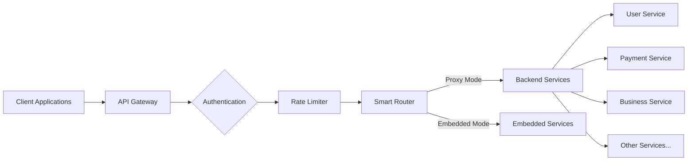

# 🌐 @pika/api-gateway - Intelligent Service Orchestration & API Management


## 🎯 Purpose & Vision

The API Gateway serves as the **single entry point** for all client requests to the Pika platform. It provides intelligent request routing, centralized authentication, and seamless service orchestration while maintaining the flexibility to operate in both microservices and monolithic deployment modes.

## 🚀 Quick Start

```bash
# Development mode (with service discovery)
yarn nx run @pika/api-gateway:local

# Embedded mode (for serverless/edge)
EMBEDDED_MODE=true yarn nx run @pika/api-gateway:local

# Access the gateway
curl http://localhost:5500/api/v1/health
```

## 📋 Overview

The API Gateway is a sophisticated service orchestration layer that:

- **Routes Requests**: Intelligently proxies requests to appropriate backend services
- **Authenticates**: Validates JWT tokens and propagates user context
- **Rate Limits**: Protects backend services from abuse
- **Monitors Health**: Provides comprehensive health checks for all services
- **Documents APIs**: Serves interactive API documentation
- **Handles Errors**: Provides consistent error responses across all services
- **Supports Multiple Deployment Modes**: Microservices (proxy) or Monolithic (embedded)

### Key Features

- 🔐 **Centralized Authentication**: JWT validation with Redis-backed token blacklisting
- 🚦 **Smart Rate Limiting**: Configurable per-route rate limiting
- 📊 **Health Monitoring**: Real-time health checks for all downstream services
- 📚 **API Documentation**: Auto-generated docs from OpenAPI specs
- 🔄 **Dual Deployment Modes**: Proxy mode for development, embedded for production
- 🌍 **Context Propagation**: Distributed tracing headers and user context
- ⚡ **Performance Optimized**: Minimal latency overhead with streaming proxies

## 🏗️ Architecture

### Gateway Pattern



### Core Components

1. **Authentication Layer** (`authMiddleware`)
   - JWT token validation
   - User context extraction
   - Token blacklist checking
   - Public endpoint bypass

2. **Proxy Layer** (`setupProxyRoutes`)
   - Dynamic service routing
   - Request/response transformation
   - Context header propagation
   - Error handling

3. **Health Check System** (`healthCheckHandler`)
   - Parallel service health checks
   - Database connectivity monitoring
   - Memory usage tracking
   - Degraded state detection

4. **Documentation Server** (`docsRoutes`)
   - OpenAPI spec serving
   - Interactive Swagger UI
   - Tier-based documentation (public/admin/internal)

### Deployment Modes

#### 1. Proxy Mode (Development/Microservices)

```typescript
// Services run independently
// Gateway proxies requests to service URLs
setupProxyRoutes(app, isLocalDev)
```

#### 2. Embedded Mode (Production/Serverless)

```typescript
// All services embedded in single process
// Direct function calls instead of HTTP
const services = new Map([
  ['auth', authApp],
  ['user', userApp],
  // ...
])
const gateway = await createGatewayWithServices(services)
```

## 🔌 API Reference

### Gateway Endpoints

| Endpoint                    | Description                       | Authentication |
| --------------------------- | --------------------------------- | -------------- |
| `GET /api/v1/health`        | Gateway and services health check | None           |
| `GET /api/v1/docs`          | API documentation index           | None           |
| `GET /api/v1/docs/public`   | Public API documentation          | None           |
| `GET /api/v1/docs/admin`    | Admin API documentation           | Required       |
| `GET /api/v1/docs/internal` | Internal API documentation        | Required       |

### Service Routes

#### Public Services (`/api/v1/*`)

- `/auth` → Auth Service
- `/users` → User Service
- `/businesses` → Business Service
- `/categories` → Category Service
- `/payments` → Payment Service
- `/subscriptions` → Subscription Service
- `/communications` → Communication Service
- `/support` → Support Service
- `/files` → File Storage Service
- `/vouchers` → Voucher Service
- `/pdf` → PDF Service

#### Admin Services (`/api/v1/admin/*`)

- All services with admin endpoints

#### Internal Services (`/api/v1/internal/*`)

- Service-to-service communication only
- Requires `x-api-key` header

### Context Headers

The gateway propagates these headers to downstream services:

```typescript
// User context (set by auth middleware)
x-user-id: string
x-user-email: string
x-user-role: string

// Request tracking
x-correlation-id: string
x-request-id: string
x-session-id: string

// Distributed tracing (OpenTelemetry/Zipkin)
x-b3-traceid: string
x-b3-spanid: string
x-b3-parentspanid: string
x-b3-sampled: string
```

## 🧪 Testing Strategy

### Unit Tests

```bash
# Test routing logic
yarn vitest packages/api-gateway/src/test/unit

# Test health checks
yarn vitest healthCheckHandler.test.ts
```

### Integration Tests

```bash
# Test with real services
yarn test:integration:gateway

# Test authentication flow
yarn test:auth-gateway
```

### Load Testing

```bash
# Test rate limiting
artillery run tests/load/rate-limit.yml

# Test proxy performance
artillery run tests/load/proxy-perf.yml
```

## 🔧 Configuration

### Environment Variables

```bash
# Gateway Configuration
API_GATEWAY_PORT=5500              # Gateway port
API_GATEWAY_BASE_URL=http://localhost:5500

# Authentication
JWT_SECRET=your-secret-key         # JWT signing secret (min 32 chars)
JWT_PUBLIC_KEY=-----BEGIN...       # RSA public key for verification

# Rate Limiting
RATE_LIMIT_ENABLE=true             # Enable rate limiting
RATE_LIMIT_MAX=40                  # Max requests per window
RATE_LIMIT_WINDOW_MS=60000         # Rate limit window (1 minute)

# CORS Configuration
CORS_ORIGIN=*                      # Allowed origins
ENABLE_CORS=true                   # Enable CORS
ENABLE_COMPRESSION=true            # Enable gzip compression

# Health Checks
HEALTH_CHECK_INTERVAL=30000        # Check interval (30s)
HEALTH_CHECK_MEMORY_THRESHOLD=85   # Memory usage threshold (%)

# Service URLs (Proxy Mode)
AUTH_API_URL=http://localhost:5502
USER_API_URL=http://localhost:5501
BUSINESS_API_URL=http://localhost:5511
CATEGORY_API_URL=http://localhost:5512
# ... other service URLs

# Deployment Mode
EMBEDDED_MODE=false                # Set to true for monolithic deployment

# Redis Configuration
REDIS_HOST=localhost
REDIS_PORT=6379
CACHE_DISABLED=false               # Disable for in-memory fallback
```

### Rate Limit Configuration

```typescript
// Per-route rate limiting
const rateLimitConfig = {
  '/api/v1/auth/login': { max: 5, windowMs: 300000 }, // 5 per 5 min
  '/api/v1/auth/register': { max: 3, windowMs: 3600000 }, // 3 per hour
  '/api/v1/payments': { max: 20, windowMs: 60000 }, // 20 per minute
  default: { max: 40, windowMs: 60000 }, // 40 per minute
}
```

## 🔄 Integration Points

### Upstream Dependencies

- **@pika/http**: Express server creation and middleware
- **@pika/auth**: JWT validation middleware
- **@pika/shared**: Logging and error handling
- **@pika/environment**: Configuration management
- **@pika/redis**: Token blacklisting and caching

### Downstream Services

- All Pika microservices (auth, user, business, etc.)
- Connects via HTTP in proxy mode
- Direct function calls in embedded mode

### External Integrations

- **Redis**: Token blacklisting, rate limit counters
- **OpenTelemetry**: Distributed tracing support
- **Prometheus**: Metrics export (planned)

## 📊 Performance & Monitoring

### Performance Characteristics

- **Latency Overhead**: < 5ms per request in proxy mode
- **Memory Usage**: ~150MB base, +50MB per 1000 concurrent connections
- **CPU Usage**: Minimal, mostly I/O bound
- **Throughput**: 10,000+ requests/second on standard hardware

### Monitoring Endpoints

```bash
# Health check with service status
GET /api/v1/health

# Response format
{
  "status": "healthy" | "degraded" | "unhealthy",
  "timestamp": "2024-01-01T00:00:00Z",
  "version": "1.0.0",
  "uptime": 3600,
  "memoryUsage": {
    "rss": 156291072,
    "heapUsed": 89234432,
    "memoryThreshold": 85
  },
  "services": {
    "auth": { "status": "healthy", "responseTime": 12 },
    "user": { "status": "healthy", "responseTime": 8 },
    // ...
  },
  "databases": {
    "pgsql": { "status": "healthy", "responseTime": 10 },
    "redis": { "status": "healthy", "responseTime": 5 }
  }
}
```

### Metrics Collection

- Request count by service
- Response time percentiles (p50, p95, p99)
- Error rate by service
- Rate limit violations
- Authentication failures

## 🔒 Security Considerations

### Authentication Flow

1. Client sends request with JWT token
2. Gateway validates token signature
3. Gateway checks token blacklist (Redis)
4. Gateway extracts user context
5. Gateway forwards context headers to services

### Security Features

- **JWT Validation**: RS256 algorithm with public key verification
- **Token Blacklisting**: Revoked tokens stored in Redis
- **Rate Limiting**: DDoS protection at gateway level
- **CORS Policy**: Configurable origin restrictions
- **Helmet.js**: Security headers for XSS, clickjacking protection
- **Request Sanitization**: Input validation before proxying

### Public Endpoints

These endpoints bypass authentication:

- `/api/v1/auth/login`
- `/api/v1/auth/register`
- `/api/v1/auth/forgot-password`
- `/api/v1/auth/reset-password`
- `/api/v1/health`
- `/api/v1/docs/*`

## 🚨 Error Handling

### Error Response Format

```json
{
  "error": {
    "code": "GATEWAY_ERROR",
    "message": "User-friendly error message",
    "details": "Technical details for debugging",
    "correlationId": "abc-123-def",
    "timestamp": "2024-01-01T00:00:00Z"
  }
}
```

### Common Error Codes

| Code              | Status | Description                  |
| ----------------- | ------ | ---------------------------- |
| `UNAUTHORIZED`    | 401    | Missing or invalid JWT token |
| `FORBIDDEN`       | 403    | Insufficient permissions     |
| `RATE_LIMITED`    | 429    | Rate limit exceeded          |
| `BAD_GATEWAY`     | 502    | Backend service unavailable  |
| `GATEWAY_TIMEOUT` | 504    | Backend service timeout      |

### Error Handling Strategy

1. Catch errors at gateway level
2. Log with correlation ID
3. Transform to consistent format
4. Return appropriate HTTP status
5. Hide internal details in production

## 📈 Future Roadmap

### Planned Enhancements

- [ ] **Circuit Breaker**: Automatic service failure detection
- [ ] **Request Caching**: Cache GET requests at gateway
- [ ] **WebSocket Support**: Real-time communication proxy
- [ ] **GraphQL Gateway**: Unified GraphQL endpoint
- [ ] **Service Mesh Integration**: Istio/Linkerd support
- [ ] **API Versioning**: Multiple API version support
- [ ] **Request Transformation**: Request/response mapping
- [ ] **OAuth2 Proxy**: Third-party authentication
- [ ] **Metrics Dashboard**: Real-time gateway metrics
- [ ] **Dynamic Routing**: Runtime route configuration

### Performance Optimizations

- [ ] HTTP/2 support for multiplexing
- [ ] Connection pooling for backend services
- [ ] Response compression optimization
- [ ] Caching strategy for static responses

## 🤝 Contributing

### Development Workflow

1. **Local Setup**: Ensure all services are running
2. **Test Changes**: Run integration tests
3. **Update Routes**: Modify service configuration if needed
4. **Document**: Update this README for significant changes
5. **Performance Test**: Ensure no latency regression

### Code Standards

- Use TypeScript strict mode
- Follow Express middleware patterns
- Maintain < 5ms latency overhead
- Test both deployment modes
- Document all configuration options

## 📝 Changelog

### Recent Changes

- Added embedded mode for serverless deployment
- Implemented comprehensive health checks
- Added distributed tracing support
- Improved error handling and logging
- Added per-route rate limiting

### Migration Notes

- v2.0: Switched from Fastify to Express for better middleware ecosystem
- v2.1: Added embedded mode for Vercel deployment
- v2.2: Implemented Redis-backed token blacklisting

---

**Gateway Version**: 2.2.0  
**Last Updated**: 2025-01-27  
**Maintainer**: Platform Team
