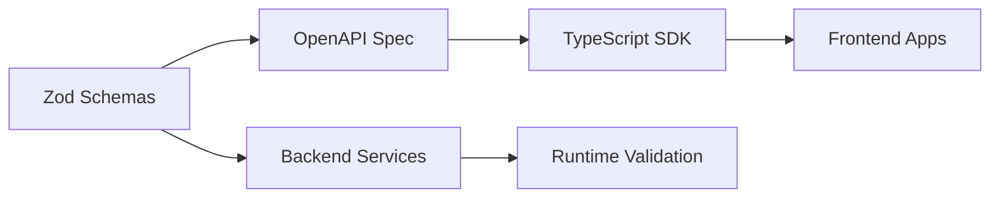

# 📜 @pika/api - Contract-First API Development & Schema Management


## 🎯 Purpose & Vision

The API package serves as the **single source of truth** for all API contracts across the Pika platform. It transforms TypeScript-first schema definitions into OpenAPI specifications, ensuring type safety from backend services to frontend SDKs while enabling automatic API documentation generation.

## 🚀 Quick Start

```bash
# Generate OpenAPI specifications
yarn nx run @pika/api:generate:openapi

# Generate interactive documentation
yarn nx run @pika/api:generate:docs

# Build the package
yarn nx run @pika/api:build

# View documentation
yarn nx run @pika/api:open:docs
```

## 📋 Overview

The API package is a sophisticated schema management system that:

- **Defines Schemas**: Type-safe API contracts using Zod
- **Generates OpenAPI**: Automatic OpenAPI 3.1 specification generation
- **Validates Requests**: Runtime validation with detailed error messages
- **Creates Documentation**: Interactive API documentation with Scalar
- **Exports Types**: TypeScript types for frontend SDK generation
- **Organizes by Tier**: Public, Admin, and Internal API separation
- **Enables Code Generation**: Foundation for client SDK generation

### Key Features

- 🔒 **Type-First Development**: Zod schemas as the source of truth
- 📝 **Auto Documentation**: OpenAPI specs generated from code
- 🎯 **Three-Tier Architecture**: Clear separation of API access levels
- 🔄 **Schema Reusability**: Shared schemas across services
- ✅ **Runtime Validation**: Automatic request/response validation
- 🌐 **SDK Generation Ready**: Exports for frontend type generation
- 📊 **Comprehensive Coverage**: All services documented in one place

## 🏗️ Architecture

### Schema Organization Pattern

```
src/schemas/
├── [service]/                    # Service-specific schemas
│   ├── public/                   # Customer-facing APIs
│   │   ├── [feature].ts         # Feature schemas
│   │   └── index.ts             # Public exports
│   ├── admin/                    # Admin panel APIs
│   │   ├── management.ts        # CRUD operations
│   │   └── index.ts             # Admin exports
│   ├── internal/                 # Service-to-service APIs
│   │   ├── service.ts           # Internal operations
│   │   └── index.ts             # Internal exports
│   ├── common/                   # Shared schemas
│   │   ├── enums.ts             # Service enums
│   │   ├── parameters.ts        # Common parameters
│   │   ├── sorting.ts           # Sort configurations
│   │   └── index.ts             # Common exports
│   └── index.ts                 # Service exports
├── shared/                       # Platform-wide schemas
│   ├── branded.ts               # Branded types (IDs)
│   ├── pagination.ts            # Pagination schemas
│   ├── errors.ts                # Error responses
│   └── responses.ts             # Common responses
└── index.ts                     # Main exports
```

### Three-Tier API Design

#### 1. Public API (`/public`)

- Customer-facing endpoints
- Mobile app & web client APIs
- Requires user authentication
- Rate limited

#### 2. Admin API (`/admin`)

- Dashboard & backoffice operations
- Requires admin role
- Extended functionality
- Audit logging

#### 3. Internal API (`/internal`)

- Service-to-service communication
- API key authentication
- Bulk operations
- No rate limiting

### Schema Definition Pattern

```typescript
// 1. Import Zod and utilities
import { z } from 'zod'
import { openapi } from '@pika/api/common'

// 2. Define base schema
export const CreateBusinessRequest = z.object({
  name: z.string().min(1).max(100),
  description: z.string().optional(),
  categoryId: z.string().uuid(),
  location: z.object({
    latitude: z.number().min(-90).max(90),
    longitude: z.number().min(-180).max(180),
  }),
})

// 3. Add OpenAPI metadata
export const CreateBusinessRequestSchema = openapi(CreateBusinessRequest, {
  description: 'Request to create a new business',
  example: {
    name: 'Acme Corp',
    categoryId: '123e4567-e89b-12d3-a456-426614174000',
    location: { latitude: 40.7128, longitude: -74.006 },
  },
})

// 4. Infer TypeScript type
export type CreateBusinessRequest = z.infer<typeof CreateBusinessRequest>
```

## 🔌 API Reference

### Package Exports

```typescript
// Main entry - all schemas
import { schemas } from '@pika/api'

// Tier-specific imports
import { publicSchemas } from '@pika/api/public'
import { adminSchemas } from '@pika/api/admin'
import { internalSchemas } from '@pika/api/internal'

// Common utilities
import { openapi, withExample } from '@pika/api/common'

// Specific service schemas
import { BusinessSchemas } from '@pika/api/schemas/business'
import { UserSchemas } from '@pika/api/schemas/user'
```

### Common Utilities

#### Schema Helpers

```typescript
// Add OpenAPI metadata
openapi(schema, { description, example, deprecated })

// Add examples
withExample(schema, exampleValue)
withExamples(schema, { example1: {...}, example2: {...} })

// Mark as deprecated
deprecated(schema, 'Use v2 endpoint instead')
```

#### Response Helpers

```typescript
// Standard response wrapper
apiResponse(schema, description, { contentType, headers })

// Multiple responses
apiResponses({
  200: { schema: SuccessSchema, description: 'Success' },
  400: { schema: ErrorSchema, description: 'Bad Request' },
})
```

#### Parameter Helpers

```typescript
// Path parameters
pathParam('id', z.string().uuid(), { description: 'Resource ID' })

// Query parameters
queryParam('page', z.number(), { description: 'Page number' })

// Pagination parameters (pre-built)
paginationParams // [page, limit, sort, order]
```

### Branded Types

```typescript
// Type-safe IDs
export const UserId = z.string().uuid().brand('UserId')
export const BusinessId = z.string().uuid().brand('BusinessId')

// Usage ensures type safety
function getUser(id: z.infer<typeof UserId>) {
  /* ... */
}
```

## 🧪 Testing Strategy

### Schema Validation Tests

```bash
# Test all schemas compile
yarn vitest compilation.test.ts

# Test schema validation
yarn test:schemas

# Test OpenAPI generation
yarn test:openapi
```

### Integration Tests

```typescript
// Test schema matches API response
it('should validate API response', async () => {
  const response = await api.getUser('123')
  const result = UserResponseSchema.safeParse(response)
  expect(result.success).toBe(true)
})
```

## 🔧 Configuration

### Environment Variables

```bash
# API Documentation
DOCS_TITLE="Pika Platform API"
DOCS_VERSION="1.0.0"
DOCS_DESCRIPTION="Modern microservices platform"

# API URLs (for documentation)
API_GATEWAY_BASE_URL=http://localhost:5500
PUBLIC_API_URL=http://localhost:5500/api/v1
ADMIN_API_URL=http://localhost:5500/api/v1/admin
INTERNAL_API_URL=http://localhost:5500/api/v1/internal

# Service Ports (for examples)
AUTH_SERVICE_PORT=5502
USER_SERVICE_PORT=5501
BUSINESS_SERVICE_PORT=5511
# ... other service ports
```

### Build Configuration

```json
{
  "scripts": {
    "build": "tsc && tsc-alias && copy openapi",
    "generate:openapi": "tsx generate-all-apis.ts",
    "generate:docs": "tsx generate-scalar-docs.ts",
    "typecheck": "tsc --noEmit",
    "test": "vitest"
  }
}
```

## 🔄 Integration Points

### Upstream Dependencies

- **zod**: Schema definition and validation
- **@asteasolutions/zod-to-openapi**: OpenAPI generation
- **@pika/types**: Shared TypeScript types
- **@pika/environment**: Configuration values

### Downstream Consumers

- **All Services**: Import schemas for validation
- **API Gateway**: Uses for request validation
- **Frontend SDK**: Generated from OpenAPI specs
- **Documentation**: Scalar UI consumes OpenAPI

### SDK Generation Flow



## 📊 Schema Standards

### Naming Conventions

```typescript
// Requests
export const CreateBusinessRequest = z.object({...})
export const UpdateBusinessRequest = z.object({...})

// Responses
export const BusinessResponse = z.object({...})
export const BusinessListResponse = z.object({...})

// Parameters
export const BusinessIdParam = z.object({
  businessId: z.string().uuid()
})

// Queries
export const BusinessQueryParams = z.object({
  search: z.string().optional(),
  categoryId: z.string().uuid().optional(),
})
```

### Pagination Pattern

```typescript
export const PaginatedResponse = <T>(itemSchema: z.ZodType<T>) =>
  z.object({
    data: z.array(itemSchema),
    pagination: z.object({
      page: z.number(),
      limit: z.number(),
      total: z.number(),
      totalPages: z.number(),
    }),
  })
```

### Error Response Pattern

```typescript
export const ErrorResponse = z.object({
  error: z.object({
    code: z.string(),
    message: z.string(),
    details: z.any().optional(),
    timestamp: z.string().datetime(),
  }),
})
```

## 🔒 Security Considerations

### Schema Security

- **Input Validation**: Strict validation rules
- **Output Sanitization**: Remove sensitive fields
- **Type Coercion**: Explicit coercion for safety
- **Max Lengths**: Prevent DoS via large inputs
- **Regex Validation**: Careful pattern matching

### Sensitive Data Handling

```typescript
// Never expose in public schemas
const InternalUserSchema = UserSchema.omit({
  passwordHash: true,
  salt: true,
  apiKey: true,
})

// Use transformers for output
const PublicUserSchema = UserSchema.transform((user) => ({
  id: user.id,
  name: user.name,
  // Omit sensitive fields
}))
```

## 🚨 Error Handling

### Validation Errors

```typescript
// Zod provides detailed errors
const result = schema.safeParse(data)
if (!result.success) {
  const errors = result.error.format()
  // Structured error information
}
```

### Schema Evolution

```typescript
// Version schemas when breaking changes needed
export const UserResponseV1 = z.object({...})
export const UserResponseV2 = z.object({...})

// Use discriminated unions
export const UserResponse = z.discriminatedUnion('version', [
  UserResponseV1.extend({ version: z.literal('v1') }),
  UserResponseV2.extend({ version: z.literal('v2') }),
])
```

## 📈 Future Roadmap

### Planned Enhancements

- [ ] **GraphQL Schema Generation**: Generate GraphQL from Zod
- [ ] **Mock Data Generation**: Auto-generate test data
- [ ] **Schema Versioning**: Formal versioning system
- [ ] **Breaking Change Detection**: CI/CD integration
- [ ] **Schema Registry**: Central schema repository
- [ ] **Runtime Type Guards**: Generated type guards
- [ ] **API Client Generation**: Multiple language targets
- [ ] **Schema Composition**: Advanced schema builders
- [ ] **Documentation Plugins**: Custom doc extensions
- [ ] **Performance Monitoring**: Schema validation metrics

### Schema Optimization

- [ ] Lazy schema compilation
- [ ] Schema caching strategies
- [ ] Validation performance tuning
- [ ] Memory usage optimization

## 🤝 Contributing

### Adding New Schemas

1. **Choose Correct Tier**: Public, Admin, or Internal
2. **Follow Naming Convention**: Request/Response suffixes
3. **Add OpenAPI Metadata**: Description and examples
4. **Export Properly**: Update index files
5. **Generate Specs**: Run generation scripts
6. **Test Validation**: Add schema tests

### Schema Best Practices

- Keep schemas close to usage
- Reuse common patterns
- Document complex validations
- Provide realistic examples
- Consider frontend needs

## 📝 Changelog

### Recent Changes

- Migrated from TypeBox to Zod
- Added three-tier API separation
- Implemented branded types for IDs
- Added comprehensive OpenAPI metadata
- Integrated Scalar documentation

### Migration Notes

- v2.0: TypeBox → Zod migration
- v2.1: Added schema organization pattern
- v2.2: Integrated OpenAPI generation
- v2.3: Added branded types

---

**Package Version**: 2.3.0  
**Last Updated**: 2025-01-27  
**Maintainer**: Platform Team
