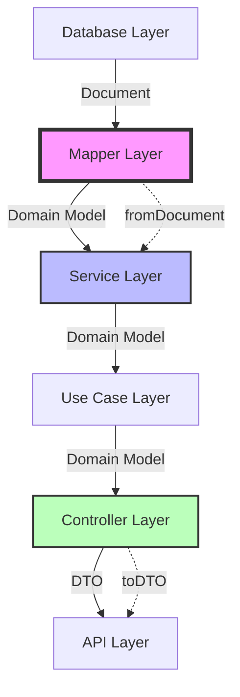

# 🎉 @pika/sdk - Domain Models, DTOs & Data Mappers


## 🎯 Purpose & Vision

The SDK package is the **data transformation powerhouse** of the Pika platform. It provides domain models, Data Transfer Objects (DTOs), and mapper classes that ensure type-safe data flow between different architectural layers. This package implements the Clean Architecture principle of separating business entities from external concerns, enabling consistent data representation across the entire platform.

## 🚀 Quick Start

```bash
# Install dependencies
yarn install

# Build the package
yarn nx run @pika/sdk:build

# Generate OpenAPI client (if needed)
yarn nx run @pika/sdk:generate

# Run tests
yarn nx run @pika/sdk:test
```

## 📋 Overview

The SDK package is a comprehensive data modeling library that:

- **Defines Domain Models**: Business entities with behavior
- **Provides DTOs**: API-specific data structures
- **Implements Mappers**: Type-safe transformations between layers
- **Ensures Type Safety**: Full TypeScript support
- **Maintains Clean Architecture**: Layer separation
- **Supports All Entities**: Users, businesses, vouchers, categories, etc.
- **Handles Complex Relations**: Nested objects and references
- **Manages Date/Time**: Consistent timezone handling

### Key Features

- 🏗️ **Clean Architecture**: Strict separation of concerns
- 🔄 **Bidirectional Mapping**: Document ↔ Domain ↔ DTO
- 🧩 **Type Safety**: No `any` types, full inference
- 📊 **Consistent Patterns**: Standardized mapper methods
- 🌐 **i18n Support**: Translation key handling
- 📅 **Date Management**: ISO 8601 formatting
- 🔗 **Relation Handling**: Deep object mapping
- 🛡️ **Null Safety**: Proper null/undefined handling

## 🏗️ Architecture

### Package Structure

```
src/
├── domain/                   # Domain Models (Business Entities)
│   ├── user.ts              # User entity with business logic
│   ├── business.ts          # Business entity
│   ├── category.ts          # Category hierarchy
│   ├── voucher.ts           # Voucher with rules
│   ├── voucher-book.ts      # Voucher book management
│   ├── payment.ts           # Payment transactions
│   ├── subscription.ts      # Subscription model
│   ├── communication.ts     # Communication logs
│   ├── problem.ts           # Support tickets
│   ├── file-storage.ts      # File metadata
│   └── index.ts             # Domain exports
├── dto/                      # Data Transfer Objects
│   ├── user.dto.ts          # User API representations
│   ├── business.dto.ts      # Business DTOs
│   ├── category.dto.ts      # Category DTOs
│   ├── voucher.dto.ts       # Voucher DTOs
│   ├── payment.dto.ts       # Payment DTOs
│   └── index.ts             # DTO exports
├── mappers/                  # Data Transformation Layer
│   ├── UserMapper.ts        # User transformations
│   ├── BusinessMapper.ts    # Business transformations
│   ├── CategoryMapper.ts    # Category transformations
│   ├── VoucherMapper.ts     # Voucher transformations
│   ├── VoucherBookMapper.ts # Book transformations
│   ├── PaymentMapper.ts     # Payment transformations
│   ├── internal/            # Internal service mappers
│   │   └── InternalCommunicationMapper.ts
│   └── index.ts             # Mapper exports
├── libs/                     # Utilities
│   └── logger.ts            # SDK-specific logger
├── api.ts                   # Generated API client types
└── index.ts                 # Package exports
```

### Clean Architecture Layers



## 🔄 Mapper Pattern

### Standard Mapper Interface

```typescript
export class EntityMapper {
  /**
   * Transforms database document to domain model
   * @param doc Database document (from Prisma)
   * @returns Domain entity with business logic
   */
  static fromDocument(doc: EntityDocument): EntityDomain

  /**
   * Transforms domain model to API DTO
   * @param domain Domain entity
   * @returns DTO for API responses
   */
  static toDTO(domain: EntityDomain): EntityDTO

  /**
   * Transforms API DTO to domain model
   * @param dto API data transfer object
   * @returns Domain entity
   */
  static fromDTO(dto: EntityDTO): EntityDomain

  /**
   * Transforms create DTO to domain data
   * @param dto Create request DTO
   * @returns Domain creation data
   */
  static fromCreateDTO(dto: CreateEntityDTO): CreateEntityData

  /**
   * Transforms update DTO to domain data
   * @param dto Update request DTO
   * @returns Domain update data (partial)
   */
  static fromUpdateDTO(dto: UpdateEntityDTO): UpdateEntityData
}
```

### Example: Category Mapper

```typescript
import { CategoryMapper } from '@pika/sdk'

// Database to Domain (Repository Layer)
const categoryDoc = await prisma.category.findUnique({ where: { id } })
const categoryDomain = CategoryMapper.fromDocument(categoryDoc)

// Domain to DTO (Controller Layer)
const categoryDTO = CategoryMapper.toDTO(categoryDomain)
response.json(categoryDTO)

// Create DTO to Domain (Service Layer)
const createData = CategoryMapper.fromCreateDTO(request.body)
const newCategory = await categoryService.create(createData)

// Nested Relations
const categoryWithChildren = CategoryMapper.fromDocument({
  ...categoryDoc,
  children: childDocs,
  parent: parentDoc,
})
```

## 📊 Domain Models

### User Domain Model

```typescript
export interface UserDomain {
  // Identity
  id: string
  email: string
  role: UserRole
  status: UserStatus

  // Profile
  profile?: UserProfileDomain

  // Business Logic
  isActive(): boolean
  canPerformAction(action: UserAction): boolean
  hasPermission(resource: string, action: string): boolean

  // Timestamps
  createdAt: Date
  updatedAt: Date
  lastLoginAt?: Date
}

export interface UserProfileDomain {
  firstName: string
  lastName: string
  phoneNumber?: string
  dateOfBirth?: Date
  avatarUrl?: string
  preferredLanguage: string

  // Computed Properties
  get fullName(): string
  get age(): number | null
}
```

### Business Domain Model

```typescript
export interface BusinessDomain {
  // Identity
  id: string
  businessNameKey: string // Translation key
  businessDescKey?: string // Translation key
  slug: string

  // Relations
  categoryId: string
  category?: CategoryDomain
  ownerId: string
  owner?: UserDomain

  // Location
  location?: {
    latitude: number
    longitude: number
    address?: string
  }

  // Business Rules
  canOperate(): boolean
  isInServiceArea(lat: number, lng: number): boolean
  calculateDistance(lat: number, lng: number): number

  // Status
  status: BusinessStatus
  verificationStatus: VerificationStatus

  // Timestamps
  createdAt: Date
  updatedAt: Date
}
```

### Voucher Domain Model

```typescript
export interface VoucherDomain {
  // Identity
  id: string
  code: string // Unique voucher code
  businessId: string
  business?: BusinessDomain

  // Content (i18n)
  titleKey: string // Translation key
  descriptionKey: string // Translation key
  termsKey: string // Translation key

  // Discount
  discountType: DiscountType
  discountValue: number
  minimumPurchase?: number
  maximumDiscount?: number

  // Validity
  validFrom: Date
  expiresAt: Date

  // Limits
  maxRedemptions?: number
  maxPerUser: number
  currentRedemptions: number

  // State
  state: VoucherState

  // Business Rules
  isValid(): boolean
  canBeRedeemed(userId: string): boolean
  calculateDiscount(amount: number): number
  getRemainingRedemptions(): number | null

  // Timestamps
  createdAt: Date
  updatedAt: Date
}
```

## 📦 Data Transfer Objects (DTOs)

### User DTO

```typescript
export interface UserDTO {
  id: string
  email: string
  role: string // Enum serialized as string
  status: string // Enum serialized as string
  profile?: UserProfileDTO
  createdAt: string // ISO 8601
  updatedAt: string // ISO 8601
  lastLoginAt?: string // ISO 8601
}

export interface CreateUserDTO {
  email: string
  password: string
  role?: string
  profile: {
    firstName: string
    lastName: string
    phoneNumber?: string
    dateOfBirth?: string // ISO 8601
    preferredLanguage?: string
  }
}

export interface UpdateUserDTO {
  email?: string
  status?: string
  profile?: Partial<UserProfileDTO>
}
```

### Voucher DTO

```typescript
export interface VoucherDTO {
  id: string
  code: string
  businessId: string
  business?: BusinessDTO // Nested if included

  // Content
  titleKey: string
  descriptionKey: string
  termsKey: string

  // Discount
  discountType: string
  discountValue: string // Decimal as string
  minimumPurchase?: string
  maximumDiscount?: string

  // Validity
  validFrom: string // ISO 8601
  expiresAt: string // ISO 8601

  // Limits
  maxRedemptions?: number
  maxPerUser: number
  currentRedemptions: number
  remainingRedemptions?: number

  // State
  state: string
  isValid: boolean // Computed field

  // Timestamps
  createdAt: string
  updatedAt: string
}
```

## 🔧 Usage Examples

### Service Layer Usage

```typescript
import { UserMapper, UserDomain } from '@pika/sdk'
import { PrismaClient } from '@prisma/client'

export class UserService {
  constructor(private prisma: PrismaClient) {}

  async findById(id: string): Promise<UserDomain | null> {
    const userDoc = await this.prisma.user.findUnique({
      where: { id },
      include: { profile: true },
    })

    if (!userDoc) return null

    // Transform to domain model
    return UserMapper.fromDocument(userDoc)
  }

  async create(data: CreateUserData): Promise<UserDomain> {
    const userDoc = await this.prisma.user.create({
      data: {
        email: data.email,
        passwordHash: data.passwordHash,
        role: data.role,
        profile: {
          create: data.profile,
        },
      },
      include: { profile: true },
    })

    return UserMapper.fromDocument(userDoc)
  }
}
```

### Controller Layer Usage

```typescript
import { UserMapper, UserDTO } from '@pika/sdk'
import { Request, Response } from 'express'

export class UserController {
  constructor(private userService: UserService) {}

  async getUser(req: Request, res: Response): Promise<void> {
    const { id } = req.params

    // Service returns domain model
    const user = await this.userService.findById(id)

    if (!user) {
      res.status(404).json({ error: 'User not found' })
      return
    }

    // Transform to DTO for API response
    const userDTO = UserMapper.toDTO(user)
    res.json(userDTO)
  }

  async createUser(req: Request, res: Response): Promise<void> {
    // Transform request DTO to domain data
    const createData = UserMapper.fromCreateDTO(req.body)

    // Service accepts domain data
    const user = await this.userService.create(createData)

    // Transform result to DTO
    const userDTO = UserMapper.toDTO(user)
    res.status(201).json(userDTO)
  }
}
```

### Complex Mapping Example

```typescript
import { VoucherMapper, VoucherDomain } from '@pika/sdk'

// Handle nested relations
const voucherWithBusiness = VoucherMapper.fromDocument({
  ...voucherDoc,
  business: businessDoc,
  redemptions: redemptionDocs,
})

// Partial updates
const updateData = VoucherMapper.fromUpdateDTO({
  titleKey: 'new.title.key',
  discountValue: '25.50',
  expiresAt: '2024-12-31T23:59:59Z',
})

// Array transformations
const vouchers = await prisma.voucher.findMany()
const voucherDomains = VoucherMapper.fromDocumentArray(vouchers)
const voucherDTOs = VoucherMapper.toDTOArray(voucherDomains)
```

## 🌐 Internationalization Support

### Translation Key Pattern

```typescript
// Domain models use translation keys
interface BusinessDomain {
  businessNameKey: string      // e.g., "business.123.name"
  businessDescKey?: string     // e.g., "business.123.description"
}

// DTOs preserve keys for frontend
interface BusinessDTO {
  businessNameKey: string      // Frontend resolves translations
  businessDescKey?: string
}

// Mapper preserves keys
static toDTO(domain: BusinessDomain): BusinessDTO {
  return {
    businessNameKey: domain.businessNameKey,
    businessDescKey: domain.businessDescKey || undefined
  }
}
```

## 📅 Date/Time Handling

### Consistent Date Management

```typescript
// Domain uses Date objects
interface DomainModel {
  createdAt: Date
  updatedAt: Date
  scheduledFor?: Date
}

// DTOs use ISO 8601 strings
interface DTOModel {
  createdAt: string          // "2024-01-27T10:30:00.000Z"
  updatedAt: string
  scheduledFor?: string
}

// Mapper handles conversion
static toDTO(domain: DomainModel): DTOModel {
  return {
    createdAt: domain.createdAt.toISOString(),
    updatedAt: domain.updatedAt.toISOString(),
    scheduledFor: domain.scheduledFor?.toISOString()
  }
}

static fromDTO(dto: DTOModel): DomainModel {
  return {
    createdAt: new Date(dto.createdAt),
    updatedAt: new Date(dto.updatedAt),
    scheduledFor: dto.scheduledFor ? new Date(dto.scheduledFor) : undefined
  }
}
```

## 🧪 Testing

### Mapper Tests

```typescript
describe('UserMapper', () => {
  describe('fromDocument', () => {
    it('should map database document to domain model', () => {
      const doc = {
        id: '123',
        email: 'test@example.com',
        role: 'customer',
        status: 'active',
        createdAt: new Date('2024-01-01'),
        updatedAt: new Date('2024-01-02'),
      }

      const domain = UserMapper.fromDocument(doc)

      expect(domain.id).toBe('123')
      expect(domain.email).toBe('test@example.com')
      expect(domain.role).toBe(UserRole.CUSTOMER)
      expect(domain.createdAt).toBeInstanceOf(Date)
    })
  })

  describe('toDTO', () => {
    it('should format dates as ISO strings', () => {
      const domain = {
        id: '123',
        createdAt: new Date('2024-01-01T10:00:00Z'),
        updatedAt: new Date('2024-01-02T15:30:00Z'),
      }

      const dto = UserMapper.toDTO(domain)

      expect(dto.createdAt).toBe('2024-01-01T10:00:00.000Z')
      expect(dto.updatedAt).toBe('2024-01-02T15:30:00.000Z')
    })
  })
})
```

## 🚨 Best Practices

### Mapper Rules

1. **Never import Prisma types in mappers** - Use generic interfaces
2. **Handle null/undefined explicitly** - No implicit conversions
3. **Preserve immutability** - Return new objects, don't mutate
4. **Type everything** - No `any` types allowed
5. **Document edge cases** - Comment non-obvious transformations

### Clean Architecture Principles

1. **Domain models are framework-agnostic** - No database specifics
2. **DTOs match API contracts** - Direct OpenAPI mapping
3. **Mappers are pure functions** - No side effects
4. **Unidirectional dependencies** - Domain knows nothing of infrastructure

## 📊 Performance Considerations

- **Lazy Loading**: Map relations only when included
- **Memoization**: Cache expensive transformations
- **Batch Operations**: Array methods for bulk transforms
- **Selective Mapping**: Only map required fields

## 🔄 Migration Guide

### From Direct Prisma Usage

```typescript
// Before: Direct Prisma in controllers
const user = await prisma.user.findUnique({ where: { id } })
res.json(user) // Exposes database structure!

// After: Clean Architecture with mappers
const userDoc = await prisma.user.findUnique({ where: { id } })
const userDomain = UserMapper.fromDocument(userDoc)
const userDTO = UserMapper.toDTO(userDomain)
res.json(userDTO) // Controlled API contract
```

## 📝 Changelog

### Recent Updates

- Implemented comprehensive mapper pattern for all entities
- Added support for nested relation mapping
- Enhanced date/time handling with timezone support
- Created specialized internal service mappers
- Added translation key preservation for i18n
- Implemented array transformation utilities

---

**Package Version**: 1.0.0  
**Last Updated**: 2025-01-27  
**Maintainer**: Platform Team
