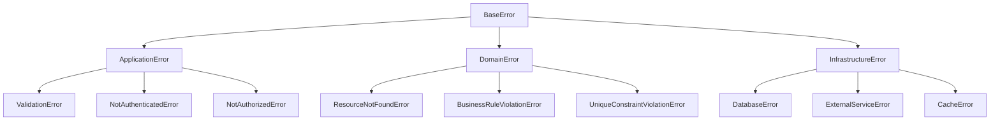

# 🎐 @pika/shared - Core Utilities & Common Functionality


## 🎯 Purpose & Vision

The Shared package is the **foundational utility library** for the entire Pika platform. It provides standardized error handling, service communication patterns, health monitoring, logging infrastructure, and common utilities. This ensures consistency, reliability, and maintainability across all microservices while promoting code reuse and reducing duplication.

## 🚀 Quick Start

```bash
# Install dependencies
yarn install

# Build the package
yarn nx run @pika/shared:build

# Run tests
yarn nx run @pika/shared:test

# Lint code
yarn nx run @pika/shared:lint
```

## 📋 Overview

The Shared package is a comprehensive utility library that:

- **Standardizes Error Handling**: Rich error taxonomy with context propagation
- **Enables Service Communication**: Type-safe HTTP clients for microservices
- **Provides Health Monitoring**: Comprehensive health check framework
- **Centralizes Logging**: Structured logging with Pino
- **Enforces Business Rules**: Domain rule validation
- **Manages Request Context**: Correlation ID and context propagation
- **Abstracts Storage**: File storage interface for multiple providers
- **Validates Data**: Common validation utilities and patterns

### Key Features

- 🚨 **Rich Error Taxonomy**: Application, Domain, and Infrastructure errors
- 🌐 **Service Clients**: Pre-built clients for all platform services
- 📊 **Health Checks**: Database, Redis, and system health monitoring
- 📝 **Structured Logging**: JSON logging with correlation tracking
- 🔄 **Retry Logic**: Exponential backoff with jitter
- 🔐 **Context Propagation**: Request tracking across services
- 🧩 **Type Safety**: Full TypeScript support
- 📏 **API Utilities**: Sorting, pagination, field validation

## 🏗️ Architecture

### Package Structure

```
src/
├── api/                        # API-specific utilities
│   ├── requestContextStore.ts  # AsyncLocalStorage for request context
│   ├── validateSource.ts       # Source validation utilities
│   └── index.ts               # API exports
├── domain/                     # Domain layer utilities
│   └── rules/                  # Business rule validators
│       ├── BusinessRules.ts    # Business entity rules
│       ├── CategoryRules.ts    # Category rules
│       ├── UserRules.ts        # User validation rules
│       └── VoucherRules.ts     # Voucher business rules
├── errors/                     # Comprehensive error system
│   ├── ErrorBase.ts           # Base error class with context
│   ├── ApplicationErrors.ts   # HTTP/API layer errors
│   ├── DomainErrors.ts        # Business logic errors
│   ├── InfrastructureErrors.ts # System/external errors
│   └── index.ts               # Error factory & handlers
├── infrastructure/             # Infrastructure utilities
│   ├── health/                 # Health check system
│   │   ├── HealthCheck.ts      # Health check orchestrator
│   │   ├── healthCheckRunner.ts # Parallel check execution
│   │   ├── systemCheck.ts      # CPU/memory checks
│   │   └── types.ts            # Health check interfaces
│   ├── logger/                 # Logging infrastructure
│   │   ├── Logger.ts           # Pino logger wrapper
│   │   └── index.ts            # Logger factory
│   └── storage/                # File storage abstractions
│       ├── FileStorage.ts      # Storage interface
│       └── LocalFileStorage.ts # Local implementation
├── services/                   # Service communication
│   ├── BaseServiceClient.ts   # Abstract service client
│   ├── HttpClient.ts          # Axios wrapper with retry
│   ├── clients/               # Service-specific clients
│   │   ├── BusinessServiceClient.ts
│   │   ├── CategoryServiceClient.ts
│   │   ├── CommunicationServiceClient.ts
│   │   ├── PaymentServiceClient.ts
│   │   ├── UserServiceClient.ts
│   │   └── VoucherServiceClient.ts
│   └── index.ts               # Service exports
├── utils/                      # Common utilities
│   ├── apiSorting.ts          # Sort parameter parsing
│   ├── isUuidV4.ts            # UUID validation
│   ├── validateRequiredFields.ts # Field validation
│   └── index.ts               # Utility exports
└── index.ts                    # Package exports
```

### Error Architecture



## 🚨 Error Management System

### Error Factory

```typescript
import { ErrorFactory } from '@pika/shared'

// Validation errors with field-level details
throw ErrorFactory.validationError(
  {
    email: ['Invalid email format', 'Email already exists'],
    password: ['Password must be at least 8 characters'],
  },
  { correlationId: request.id },
)

// Resource not found with context
throw ErrorFactory.resourceNotFound('User', userId, {
  source: 'UserService.getById',
  metadata: { attemptedId: userId },
})

// Database errors with original error
throw ErrorFactory.databaseError('user_insert', 'Failed to create user', originalError, { userId, correlationId })

// Business rule violations
throw ErrorFactory.businessRuleViolation('voucher_redemption_limit', 'User has exceeded maximum redemptions', { userId, voucherId, limit: 5 })
```

### Error Context & Metadata

```typescript
export interface ErrorContext {
  code: ErrorCode // Standardized error code
  httpStatus: number // HTTP status code
  severity: ErrorSeverity // CRITICAL, ERROR, WARNING, INFO
  correlationId?: string // Request tracking ID
  source?: string // Error origin (service.method)
  metadata?: Record<string, any> // Additional context
  clientInfo?: {
    // Client information
    ip?: string
    userAgent?: string
  }
}
```

### Global Error Handler

```typescript
import { createErrorHandler } from '@pika/shared'

// Express error handler with production/dev modes
app.use(createErrorHandler(process.env.NODE_ENV === 'production'))

// Handles:
// - Zod validation errors
// - Prisma database errors
// - Service communication failures
// - Unknown errors with stack traces
```

## 🌐 Service Communication

### Base Service Client

```typescript
export abstract class BaseServiceClient {
  protected readonly httpClient: HttpClient

  // Features:
  // - Automatic retry with exponential backoff
  // - Service-to-service authentication
  // - Context propagation (correlation ID, user context)
  // - Error transformation
  // - Request/response logging
  // - Health checks
}
```

### Pre-Built Service Clients

```typescript
import { UserServiceClient, BusinessServiceClient, PaymentServiceClient, VoucherServiceClient } from '@pika/shared'

// Initialize with configuration
const userClient = new UserServiceClient({
  serviceUrl: SERVICE_URLS.USER,
  serviceName: 'api-gateway',
  timeout: 5000,
  retries: 3,
})

// Type-safe methods
const user = await userClient.getUser(userId, context)
const businesses = await businessClient.searchBusinesses(
  {
    categoryId,
    location: { lat, lng, radius },
  },
  context,
)

// Internal API calls with service auth
const stats = await userClient.getUserStats(userId, {
  useServiceAuth: true,
  correlationId: request.id,
})
```

### HTTP Client Features

```typescript
// Retry configuration
interface RetryConfig {
  retries: number // Max retry attempts
  retryDelay: number // Initial delay (ms)
  maxRetryDelay: number // Maximum delay (ms)
  retryCondition: (error) => boolean // Custom retry logic
}

// Request configuration
interface RequestConfig {
  method: 'GET' | 'POST' | 'PUT' | 'DELETE'
  headers?: Record<string, string>
  params?: Record<string, any>
  data?: any
  timeout?: number
  context?: ServiceContext
  useServiceAuth?: boolean // Use service-to-service auth
}
```

## 📋 Health Check System

### Health Check Framework

```typescript
import { HealthCheck, systemCheck } from '@pika/shared'

// Configure health checks
const healthCheck = new HealthCheck({
  checks: [
    {
      name: 'database',
      critical: true,
      timeout: 5000,
      check: async () => {
        await prisma.$queryRaw`SELECT 1`
        return { status: 'healthy' }
      },
    },
    {
      name: 'redis',
      critical: true,
      check: async () => {
        const pong = await redis.ping()
        return {
          status: pong === 'PONG' ? 'healthy' : 'unhealthy',
          data: { response: pong },
        }
      },
    },
    {
      name: 'external_api',
      critical: false,
      check: async () => {
        const healthy = await externalClient.healthCheck()
        return {
          status: healthy ? 'healthy' : 'degraded',
          data: { apiStatus: healthy },
        }
      },
    },
    systemCheck, // CPU, memory, uptime checks
  ],
})

// Execute health checks
const result = await healthCheck.execute()
// Returns: HealthCheckResult with overall status and individual check results
```

### Health Check Response

```typescript
interface HealthCheckResult {
  status: 'healthy' | 'degraded' | 'unhealthy'
  timestamp: string
  uptime: number
  checks: Array<{
    name: string
    status: 'healthy' | 'unhealthy' | 'degraded'
    duration: number
    data?: any
    error?: string
  }>
}
```

## 📝 Structured Logging

### Logger Configuration

```typescript
import { logger } from '@pika/shared'

// Pino logger with structured output
logger.info('Operation completed', {
  operation: 'user.create',
  userId: user.id,
  duration: 123,
  correlationId: context.correlationId,
})

logger.error('Operation failed', {
  error: error.message,
  stack: error.stack,
  operation: 'payment.process',
  userId: user.id,
  amount: 50.0,
  correlationId: context.correlationId,
})

// Child loggers with context
const serviceLogger = logger.child({ service: 'UserService' })
serviceLogger.debug('Cache hit', { key: cacheKey })
```

### Log Levels & Structure

```typescript
// Log levels (Pino standard)
fatal: 60  // Application crash
error: 50  // Error conditions
warn: 40   // Warning conditions
info: 30   // Informational
debug: 20  // Debug information
trace: 10  // Detailed trace

// Structured log format
{
  "level": 30,
  "time": 1706438400000,
  "pid": 12345,
  "hostname": "api-gateway-abc123",
  "msg": "Request completed",
  "correlationId": "req-123",
  "userId": "user-456",
  "duration": 234,
  "statusCode": 200
}
```

## 🎯 Domain Rules

### Business Rule Validators

```typescript
import { VoucherRules, BusinessRules, UserRules } from '@pika/shared'

// Voucher validation rules
VoucherRules.canRedeem(voucher, user) // Checks limits, expiry, status
VoucherRules.isExpired(voucher) // Expiration check
VoucherRules.hasRedemptionsLeft(voucher) // Availability check

// Business rules
BusinessRules.canOperate(business) // Active status check
BusinessRules.isInServiceArea(business, location) // Geospatial check

// User rules
UserRules.canPerformAction(user, action) // Permission check
UserRules.hasActiveSubscription(user) // Subscription status
```

## 🔧 Common Utilities

### API Sorting

```typescript
import { convertApiSortParams } from '@pika/shared'

// Parse sort parameters from API
const sortParams = convertApiSortParams('name:asc,createdAt:desc')
// Returns: [{ field: 'name', direction: 'asc' }, { field: 'createdAt', direction: 'desc' }]

// Apply to Prisma
const results = await prisma.user.findMany({
  orderBy: sortParams.map((s) => ({ [s.field]: s.direction })),
})
```

### Field Validation

```typescript
import { validateRequiredFields, isUuidV4 } from '@pika/shared'

// Validate required fields exist
validateRequiredFields(data, ['name', 'email', 'categoryId'])
// Throws ValidationError if fields missing

// UUID validation
if (!isUuidV4(id)) {
  throw ErrorFactory.validationError({ id: ['Must be valid UUID v4'] })
}
```

### Request Context

```typescript
import { requestContextStore } from '@pika/shared'

// Middleware to set context
app.use((req, res, next) => {
  const context = {
    correlationId: req.headers['x-correlation-id'] || uuid(),
    userId: req.user?.id,
    userAgent: req.headers['user-agent'],
  }

  requestContextStore.run(context, () => next())
})

// Access context anywhere
const context = requestContextStore.getStore()
logger.info('Processing request', { correlationId: context.correlationId })
```

## 🧪 Testing

### Unit Tests

```typescript
describe('ErrorFactory', () => {
  it('should create validation error with fields', () => {
    const error = ErrorFactory.validationError({
      email: ['Invalid format'],
      age: ['Must be positive'],
    })

    expect(error.code).toBe(ErrorCode.VALIDATION_ERROR)
    expect(error.httpStatus).toBe(400)
    expect(error.validationErrors).toEqual({
      email: ['Invalid format'],
      age: ['Must be positive'],
    })
  })
})

describe('Service Clients', () => {
  it('should retry on failure', async () => {
    const client = new TestServiceClient({ retries: 3 })
    // Test retry logic
  })
})
```

## 📊 Performance Considerations

- **Connection Pooling**: HTTP clients reuse connections
- **Retry Jitter**: Prevents thundering herd on retries
- **Context Storage**: AsyncLocalStorage for zero-overhead context
- **Lazy Loading**: Service clients initialized on demand
- **Error Serialization**: Efficient error object creation

## 🛡️ Security Features

- **Service Authentication**: API key validation for internal calls
- **Context Sanitization**: PII removal from logs
- **Error Filtering**: Stack traces hidden in production
- **Request Validation**: Input sanitization utilities

## 🔄 Migration Guide

### From Direct HTTP Calls to Service Clients

```typescript
// Before
const response = await axios.get(`${USER_SERVICE_URL}/users/${id}`)
const user = response.data

// After
const userClient = new UserServiceClient(config)
const user = await userClient.getUser(id, context)
```

### From Console.log to Structured Logging

```typescript
// Before
console.log(`User ${userId} logged in`)

// After
logger.info('User login', {
  userId,
  event: 'user.login',
  timestamp: new Date().toISOString(),
})
```

## 📝 Changelog

### Recent Updates

- Added comprehensive error taxonomy with ErrorFactory
- Implemented service client base class with retry logic
- Created health check framework with parallel execution
- Added domain rule validators for business logic
- Integrated Pino for structured logging
- Implemented request context propagation

---

**Package Version**: 1.0.0  
**Last Updated**: 2025-01-27  
**Maintainer**: Platform Team
