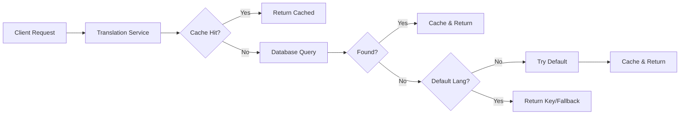

# 🌐 @pika/translation - Internationalization & Localization Service


## 🎯 Purpose & Vision

The Translation package is the **internationalization backbone** of the Pika platform. It provides a high-performance, cache-backed translation service that enables multi-language support across all microservices. Using a key-based system with Redis caching and PostgreSQL persistence, it ensures fast, consistent translations while supporting dynamic content updates and user language preferences.

## 🚀 Quick Start

```bash
# Install dependencies
yarn install

# Build the package
yarn nx run @pika/translation:build

# Run tests
yarn nx run @pika/translation:test

# Seed translations
yarn nx run @pika/translation:seed
```

## 📋 Overview

The Translation package is a comprehensive i18n solution that:

- **Manages Translations**: Key-based translation system
- **Provides Caching**: Redis-backed for performance
- **Supports Multiple Languages**: Spanish, English, Guaraní
- **Enables User Preferences**: Per-user language settings
- **Handles Fallbacks**: Graceful degradation to default language
- **Supports Bulk Operations**: Efficient batch translations
- **Detects Language**: From headers, params, or user preferences
- **Maintains Context**: Service and domain-specific translations

### Key Features

- 🚀 **High Performance**: Redis caching with TTL
- 🌍 **Multi-Language**: Support for multiple locales
- 🔄 **Dynamic Updates**: Real-time translation changes
- 👤 **User Preferences**: Personalized language settings
- 📦 **Bulk Operations**: Efficient batch processing
- 🔍 **Smart Detection**: Automatic language detection
- 🛡️ **Fallback Chain**: Default language fallback
- 📝 **Context Support**: Domain-specific translations

## 🏗️ Architecture

### Package Structure

```
src/
├── clients/                    # Client interfaces
│   └── TranslationClient.ts    # HTTP client for services
├── factories/                  # Factory patterns
│   └── TranslationServiceFactory.ts # Service creation
├── repositories/               # Data access layer
│   └── TranslationRepository.ts # Database operations
├── services/                   # Business logic
│   ├── TranslationService.ts   # Core translation logic
│   └── TranslationCache.ts     # Caching layer
├── utils/                      # Utilities
│   └── TranslationResolver.ts  # Key resolution
├── types/                      # Type definitions
│   └── index.ts               # Translation types
└── index.ts                   # Package exports
```

### Translation Flow



## 🔧 Core Components

### Translation Service

```typescript
import { TranslationService, createTranslationService } from '@pika/translation'
import { PrismaClient } from '@prisma/client'
import { createCacheService } from '@pika/redis'

// Initialize service
const translationService = await createTranslationService(new PrismaClient(), createCacheService())

// Get single translation
const text = await translationService.get(
  'welcome.message', // Translation key
  'es', // Language code
  'Welcome!', // Optional fallback
)

// Get bulk translations
const translations = await translationService.getBulk(['nav.home', 'nav.profile', 'nav.settings'], 'en')
// Returns: { 'nav.home': 'Home', 'nav.profile': 'Profile', ... }

// Set translation
await translationService.set(
  'product.new.title',
  'es',
  'Nuevo Producto',
  'product', // Optional context
  'product-service', // Optional service
)
```

### Translation Client

```typescript
import { TranslationClient } from '@pika/translation'

// For service-to-service communication
const client = new TranslationClient({
  serviceUrl: 'http://translation-service:5509',
  defaultLanguage: 'es',
  cacheService: redisCache,
})

// Resolve translations in bulk
const resolved = await client.resolveTranslations(
  {
    businessNameKey: 'business.123.name',
    businessDescKey: 'business.123.description',
    categoryNameKey: 'category.food.name',
  },
  'en',
)
// Returns object with translated values
```

### Translation Cache

```typescript
import { TranslationCache } from '@pika/translation'

const cache = new TranslationCache(redisClient, {
  ttl: 3600, // 1 hour TTL
  prefix: 'trans:', // Redis key prefix
  enableCompression: true, // Compress large translations
})

// Cache operations are handled internally by TranslationService
// Direct usage for advanced scenarios:
await cache.set('welcome.message', 'es', 'Bienvenido')
const cached = await cache.get('welcome.message', 'es')
await cache.invalidate('welcome.message', 'es')
await cache.invalidatePattern('product.*') // Invalidate all product keys
```

## 🌍 Language Detection

### Automatic Detection Strategy

```typescript
// Language detection follows this priority:
// 1. User preference header
// 2. Query parameter
// 3. Accept-Language header
// 4. User stored preference
// 5. Default language

app.use(async (req, res, next) => {
  // Detect language from request
  const language = await translationService.detectLanguage(req)

  // Store in request context
  req.language = language
  res.locals.language = language

  next()
})

// In controller
async getProducts(req: Request, res: Response) {
  const products = await productService.getAll()

  // Resolve translations for detected language
  const translated = await translationClient.resolveTranslations(
    products,
    req.language
  )

  res.json(translated)
}
```

### User Language Preferences

```typescript
// Get user's preferred language
const userLang = await translationService.getUserLanguage(userId)

// Set user's language preference
await translationService.setUserLanguage(userId, 'en')

// Middleware for authenticated routes
app.use(async (req, res, next) => {
  if (req.user) {
    req.language = await translationService.getUserLanguage(req.user.id)
  }
  next()
})
```

## 🔑 Translation Key Patterns

### Key Naming Convention

```typescript
// Domain-based keys
'category.{id}.name' // Dynamic category names
'category.{id}.description' // Category descriptions

// Business entities
'business.{id}.name' // Business names
'business.{id}.description' // Business descriptions
'business.{id}.terms' // Terms and conditions

// Vouchers
'voucher.{id}.title' // Voucher titles
'voucher.{id}.description' // Voucher descriptions
'voucher.{id}.terms' // Voucher terms

// Static UI elements
'ui.navigation.home' // Navigation items
'ui.button.submit' // Button labels
'ui.message.success' // Success messages
'ui.error.validation' // Error messages

// Email templates
'email.welcome.subject' // Email subjects
'email.welcome.body' // Email content
'email.{type}.{part}' // Dynamic email parts
```

### Context-Based Organization

```typescript
// Set translations with context
await translationService.setBulk(
  [
    {
      key: 'term.subscription',
      value: 'Suscripción',
      context: 'business', // Business context
      service: 'payment', // Payment service owns this
    },
    {
      key: 'term.subscription',
      value: 'Membresía',
      context: 'fitness', // Fitness context
      service: 'gym', // Gym service owns this
    },
  ],
  'es',
)
```

## 📊 Database Schema

### Translation Tables

```sql
-- Languages table
CREATE TABLE i18n.languages (
  id UUID PRIMARY KEY,
  code VARCHAR(5) UNIQUE NOT NULL,     -- 'es', 'en', 'gn'
  name VARCHAR(50) NOT NULL,            -- 'Español', 'English'
  nativeName VARCHAR(50),               -- 'Español', 'English'
  isActive BOOLEAN DEFAULT true,
  isDefault BOOLEAN DEFAULT false,
  createdAt TIMESTAMP DEFAULT NOW(),
  updatedAt TIMESTAMP DEFAULT NOW()
);

-- Translations table
CREATE TABLE i18n.translations (
  id UUID PRIMARY KEY,
  key VARCHAR(255) NOT NULL,            -- Translation key
  languageCode VARCHAR(5) NOT NULL,
  value TEXT NOT NULL,                  -- Translated text
  context VARCHAR(50),                  -- Optional context
  service VARCHAR(50),                  -- Owning service
  isVerified BOOLEAN DEFAULT false,     -- Human verified
  createdAt TIMESTAMP DEFAULT NOW(),
  updatedAt TIMESTAMP DEFAULT NOW(),
  UNIQUE(key, languageCode, context)
);

-- User language preferences
CREATE TABLE i18n.user_language_preferences (
  userId UUID PRIMARY KEY,
  languageCode VARCHAR(5) NOT NULL,
  createdAt TIMESTAMP DEFAULT NOW(),
  updatedAt TIMESTAMP DEFAULT NOW()
);

-- Indexes for performance
CREATE INDEX idx_translations_key_lang ON translations(key, languageCode);
CREATE INDEX idx_translations_context ON translations(context);
CREATE INDEX idx_translations_service ON translations(service);
```

## 🚀 Performance Optimization

### Caching Strategy

```typescript
// Multi-tier caching
interface CacheConfig {
  l1: {
    enabled: true
    ttl: 300 // 5 minutes in-memory
    maxSize: 1000 // Max entries
  }
  l2: {
    enabled: true
    ttl: 3600 // 1 hour in Redis
    compression: true // Compress large texts
  }
}

// Batch operations for efficiency
const resolver = new TranslationResolver(translationService, {
  batchSize: 100, // Process in batches
  concurrency: 5, // Parallel requests
  cacheResults: true, // Cache resolved objects
})

// Resolve nested objects efficiently
const resolvedProducts = await resolver.resolveDeep(products, ['nameKey', 'descriptionKey', 'category.nameKey', 'business.nameKey'], 'es')
```

### Cache Invalidation

```typescript
// Invalidate specific key
await translationCache.invalidate('product.123.name', 'es')

// Invalidate by pattern
await translationCache.invalidatePattern('product.123.*')

// Invalidate by context
await translationCache.invalidateContext('product')

// Invalidate by service
await translationCache.invalidateService('product-service')

// Webhook for translation updates
app.post('/webhooks/translation-updated', async (req, res) => {
  const { key, language } = req.body
  await translationCache.invalidate(key, language)
  res.status(200).send()
})
```

## 🧪 Testing

### Unit Tests

```typescript
describe('TranslationService', () => {
  let service: TranslationService
  let mockRepo: MockTranslationRepository
  let mockCache: MockTranslationCache

  beforeEach(() => {
    mockRepo = new MockTranslationRepository()
    mockCache = new MockTranslationCache()
    service = new TranslationService(mockRepo, mockCache, 'es')
  })

  describe('get', () => {
    it('should return cached translation', async () => {
      mockCache.set('test.key', 'en', 'Test Value')

      const result = await service.get('test.key', 'en')

      expect(result).toBe('Test Value')
      expect(mockRepo.findByKeyAndLanguage).not.toHaveBeenCalled()
    })

    it('should fallback to default language', async () => {
      mockRepo.setTranslation('test.key', 'es', 'Valor de Prueba')

      const result = await service.get('test.key', 'en')

      expect(result).toBe('Valor de Prueba')
    })
  })
})
```

### Integration Tests

```typescript
describe('Translation API', () => {
  let app: Express

  beforeAll(async () => {
    app = await createTranslationServer({
      prisma: testDb.prisma,
      cache: new MemoryCacheService(),
    })
  })

  describe('GET /translations', () => {
    it('should return bulk translations', async () => {
      const response = await request(app)
        .get('/translations')
        .query({
          keys: ['ui.welcome', 'ui.goodbye'],
          language: 'es',
        })
        .expect(200)

      expect(response.body).toEqual({
        'ui.welcome': 'Bienvenido',
        'ui.goodbye': 'Adiós',
      })
    })
  })
})
```

## 🛠️ Configuration

### Environment Variables

```bash
# Default language
DEFAULT_LANGUAGE=es

# Supported languages
SUPPORTED_LANGUAGES=es,en,gn

# Cache configuration
TRANSLATION_CACHE_TTL=3600
TRANSLATION_CACHE_PREFIX=trans:

# Service configuration
TRANSLATION_SERVICE_PORT=5509
TRANSLATION_SERVICE_HOST=0.0.0.0

# Feature flags
ENABLE_TRANSLATION_CACHE=true
ENABLE_AUTO_TRANSLATION=false
ENABLE_TRANSLATION_ANALYTICS=true
```

### Service Configuration

```typescript
export interface TranslationConfig {
  defaultLanguage: string
  supportedLanguages: string[]
  cache: {
    enabled: boolean
    ttl: number
    prefix: string
    compression: boolean
  }
  fallback: {
    enabled: boolean
    showKeys: boolean // Show keys in development
    logMissing: boolean // Log missing translations
  }
  detection: {
    headerName: string // Custom header name
    queryParam: string // Query parameter name
    cookieName?: string // Optional cookie
  }
}
```

## 🎯 Usage Examples

### In Services

```typescript
export class ProductService {
  constructor(
    private translationClient: TranslationClient,
    private productRepo: ProductRepository,
  ) {}

  async getProduct(id: string, language: string) {
    const product = await this.productRepo.findById(id)

    // Resolve translation keys
    const translated = await this.translationClient.resolveTranslations(
      {
        name: product.nameKey,
        description: product.descriptionKey,
        categoryName: product.category.nameKey,
      },
      language,
    )

    return {
      ...product,
      name: translated.name,
      description: translated.description,
      categoryName: translated.categoryName,
    }
  }
}
```

### In Controllers

```typescript
export class CategoryController {
  async getCategories(req: Request, res: Response) {
    const language = req.language || DEFAULT_LANGUAGE
    const categories = await this.categoryService.getAll()

    // Bulk resolve all translation keys
    const translationKeys = categories.flatMap((cat) => [cat.nameKey, cat.descriptionKey])

    const translations = await this.translationService.getBulk(translationKeys, language)

    // Map translations to categories
    const result = categories.map((cat) => ({
      ...cat,
      name: translations[cat.nameKey],
      description: translations[cat.descriptionKey],
    }))

    res.json(result)
  }
}
```

## 📈 Monitoring & Analytics

### Translation Analytics

```typescript
// Track missing translations
translationService.on('missing', (key, language) => {
  logger.warn('Missing translation', { key, language })
  metricsCollector.increment('translations.missing', { language })
})

// Track cache performance
translationCache.on('hit', (key) => {
  metricsCollector.increment('translation.cache.hit')
})

translationCache.on('miss', (key) => {
  metricsCollector.increment('translation.cache.miss')
})

// Monitor translation quality
const coverageReport = await translationService.getCoverageReport()
// Returns: { es: 98.5, en: 95.2, gn: 87.3 } (percentage covered)
```

## 🔄 Migration Guide

### From Hardcoded Strings

```typescript
// Before: Hardcoded strings
const welcomeMessage = 'Bienvenido a Pika'

// After: Translation keys
const welcomeMessage = await translationService.get('ui.welcome.message', userLanguage)
```

### From JSON Files

```typescript
// Before: Static JSON files
import translations from './locales/es.json'
const text = translations.welcome

// After: Dynamic translation service
const text = await translationService.get('ui.welcome', 'es')
```

## 📝 Best Practices

### Key Management

1. **Use Descriptive Keys**: `product.detail.add_to_cart` not `btn1`
2. **Namespace by Domain**: `voucher.`, `business.`, `user.`
3. **Include Context**: Add context for ambiguous terms
4. **Version Long Texts**: `email.welcome.v2.body` for iterations

### Performance Tips

1. **Batch Requests**: Use `getBulk` for multiple keys
2. **Cache Aggressively**: Translations change infrequently
3. **Preload Common**: Cache common UI translations on startup
4. **Use Fallbacks**: Always provide sensible fallbacks

## 📊 Changelog

### Recent Updates

- Implemented Redis caching layer with TTL support
- Added bulk translation operations
- Created translation resolver for nested objects
- Added user language preference management
- Implemented automatic language detection
- Added context and service ownership support

---

**Package Version**: 1.0.0  
**Last Updated**: 2025-01-27  
**Maintainer**: Platform Team
